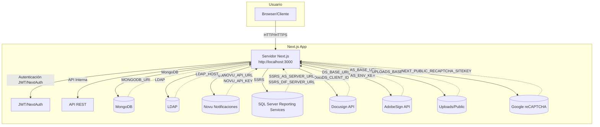

# Sitio Web Adhentux.com

Sitio instucional estatico del tipo *LandingPage*

## Instalacion
1. correr **npm install**

## Build
1. correr **npm run build** (la carpeta para deployment sera ***[dist]***)

## Extras

